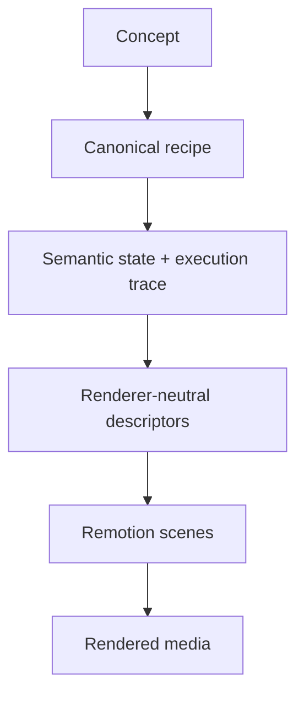
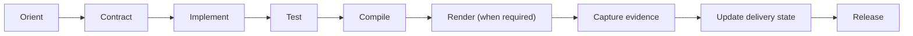

# edu-nano-games — Development Flow

This file describes the normal path from an idea or change to a verified deliverable.

## 1. Orient

1. Start at [`INDEX.md`](INDEX.md).
2. Read the relevant documentation under `docs/` before changing architecture or delivery state.
3. Check [`docs/02-delivery/02-01-work-breakdown.md`](docs/02-delivery/02-01-work-breakdown.md) for the current task state.
4. Treat `ref-01/` as reference material only; it is not a runtime dependency.

## 2. Define the Contract

For new educational behavior, establish the mathematical or gameplay contract before renderer work.

For Math Motion:



**Invariant:** mathematical truth belongs in `packages/semantic-engine` and canonical recipes. Renderers consume semantic traces/descriptors and do not recompute the mathematics.

## 3. Implement in Layers

- Put canonical concepts and recipes in `math-motion/concepts/`.
- Put mathematical execution and validation in `packages/semantic-engine/`.
- Keep visual grammar and experiments reusable and renderer-independent where practical.
- Compile validated semantic traces into deterministic renderer descriptors.
- Keep Remotion-specific behavior inside `packages/remotion-runtime/`.
- Preserve existing prototypes as research/reference assets; extract reusable behavior instead of mass-rewriting them.

## 4. Verify Deterministically

Run the smallest relevant checks first, then the repository checks when practical:

```bash
npm test
npm run build
npm run typecheck
npm run lint
npm run format:check
```

If a required command cannot run because tooling is unavailable, record the limitation rather than treating the check as passed.

For Math Motion, also verify:

- canonical recipe and semantic trace agree;
- trace replay is deterministic;
- element-count and element-values preserves hold;
- semantic operation order is unchanged;
- compiled Remotion scenes have valid, contiguous frame ranges;
- terminal state matches the semantic execution.

## 5. Render When Rendering Is Part of Acceptance

A deterministic scene descriptor is not a substitute for a real render.

When the task requires render evidence:

1. Run the actual Remotion render through `packages/remotion-runtime/`.
2. Capture the resulting artifact in `math-motion/renders/` using the repository's render convention.
3. Record source-to-render traceability.
4. Record environment limitations or failed render attempts explicitly.
5. Do not mark release evidence complete until the real render requirement is satisfied.

## 6. Update Delivery Evidence

After implementation and verification:

- update the authoritative task state in `docs/02-delivery/02-01-work-breakdown.md`;
- update relevant roadmap or quality documentation when acceptance status changes;
- preserve reproducibility evidence and known limitations;
- only mark a task **DONE** when its documented Definition of Done is actually satisfied.

## 7. Release Path



## Current Math Motion Gate

`MM-001 — 6174 Production Vertical Slice` currently has `MM-001.1` through `MM-001.4` complete. `MM-001.5 Real Render` remains the render-verification gate, and `MM-001.6 Release Evidence` remains blocked until that gate is verified.
